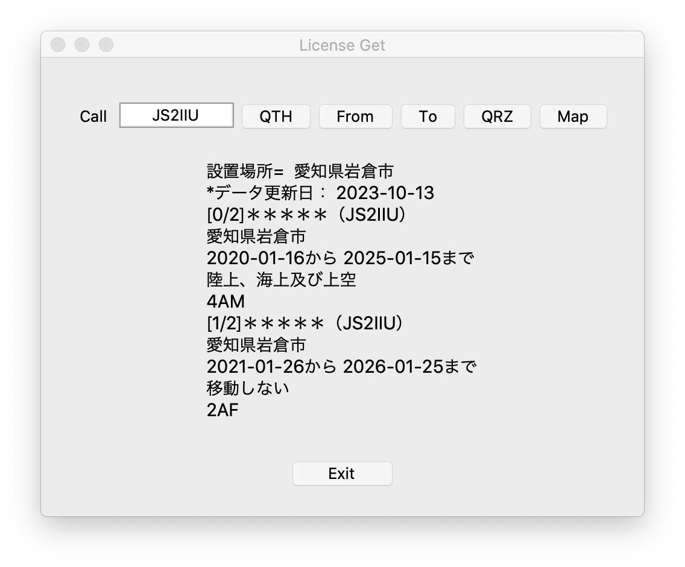

# DenpaAPI
総務省、無線局等情報検索APIからデータ取得するアプリ

[](https://github.com/pylint-dev/pylint)


免責事項等につきましては、当リポジトリの[LICENSE](LICENSE)をご覧ください。


## 無線局等情報検索機能Web-API機能

- [総務省 電波利用ホームページ｜免許関係｜Web-API機能（無線局等情報検索）について](https://www.tele.soumu.go.jp/j/musen/webapi/)
    - [Web-APIのリクエストの設定方法及び提供データの内容について](https://www.tele.soumu.go.jp/resource/j/musen/webapi/mw_req_info.pdf)
    - [Web-APIのリクエスト条件一覧](https://www.tele.soumu.go.jp/resource/j/musen/webapi/mw_req_conditions.pdf)
    - [コード値一覧](https://www.tele.soumu.go.jp/resource/j/musen/webapi/mw_code.pdf)
    - [Web-API利用規約](https://www.tele.soumu.go.jp/j/musen/webapi/kiyaku/index.htm)

## サンプルプログラム
これらサンプルプログラムを動かすにあたって、総務省無線局等情報検索機能Web-APIにアクセスします。その際にSSL Errorが出る場合があります。対処方法は次のセクションに記載していますので参考にしてください。
- [`denpa_basic.py`](denpa_basic.py)
    - 無線局検索Web-APIにアクセスするための部品。
    - アマチュア無線局の免許数検索
    - アマチュア無線局リスト取得
    - アマチュア無線局、コールサインで検索し詳細情報を得る
- [`license_gets.py`](license_gets.py)
    - コールサイン検索のGUI版。Hamlogさまの免許状Get's類似の機能。免許状検索、QRZ.com表示、マップ表示機能。
    - コールサインを入力し、QTHボタンをクリックするとコールサインのQTHと免許状情報を表示します。
    - Fromボタン、Toボタンには今のところ機能を割り当てていません。
    - QRZボタンをクリックすると、入力されたコールサインでQRZ.COMを表示します。
    - Mapボタンをクリックすると、Googleマップを表示することができます。検索した無線局設置場所の情報から市町村全体の地図を表示します。


<!--

-->
<p align="center"></p>

- [`ja_call.py`](ja_call.py)
    - JAコールサインかどうか判定する

## SSL Errorの対応方法
総務省、電波利用ホームページ、無線局等情報検索のWeb-APIにリクエストして`[SSL: UNSAFE_LEGACY_RENEGOTIATION_DISABLED] unsafe legacy renegotiation disabled`が返ってきてしまう場合、以下の対応をすることでエラー解消します。自己責任で対応ください。

### openssl.cnf
任意のディレクトリに`openssl.cnf`を作成する。

```conf
openssl_conf = openssl_init

[openssl_init]
ssl_conf = ssl_sect

[ssl_sect]
system_default = system_default_sect

[system_default_sect]
Options = UnsafeLegacyRenegotiation
```

環境変数に`OPENSSL_CONF`を追加する。作成した`openssl.cnf`をフルパスで指定する。
```sh
export OPENSSL_CONF=/path/to/custom/openssl.cnf
```
この後Pythonのスクリプトを走らせるとエラーが出なくなりました。

### SSLエラーに関する参考情報
- [python - SSL error unsafe legacy renegotiation disabled - Stack Overflow](https://stackoverflow.com/questions/71603314/ssl-error-unsafe-legacy-renegotiation-disabled)


## 参考
### Requests
- [Python requests で SSLError が起きて毎回ググってるのでまとめた - Qiita](https://qiita.com/sta/items/6d08151fd9b20fa8b319)
- [Advanced Usage — Requests 2.31.0 documentation](https://requests.kennethreitz.org/en/latest/user/advanced/#ssl-cert-verification)
- [requestsモジュールでダウンロードに失敗する時の対策方法 - ガンマソフト](https://gammasoft.jp/support/solutions-of-requests-get-failed/)
### JSON
- [【Python入門】JSONをパースする方法 - Qiita](https://qiita.com/Morio/items/5170c103647ef3a4aa69)
### Hamlog
- [Turbo HAMLOG HOMEPAGE](http://www.hamlog.com/)
- [Turbo HAMLOG最新版](https://hamlog.sakura.ne.jp/mou/index.html)
### implict relative import, explcit relative import
- [[Python] importの躓きどころ - Qiita](https://qiita.com/ysk24ok/items/2711295d83218c699276)
    > package内のモジュールをimportするためには、`from . import mymodule1`のように`relative import`であることを明示しなければならない（これを`explict relative import`と呼ぶ）。
